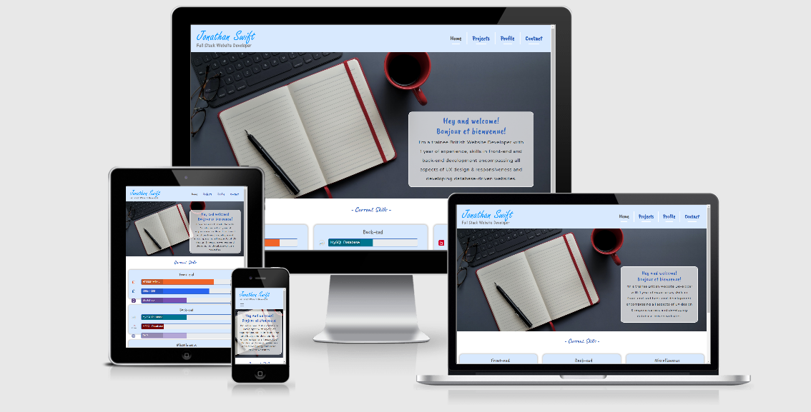
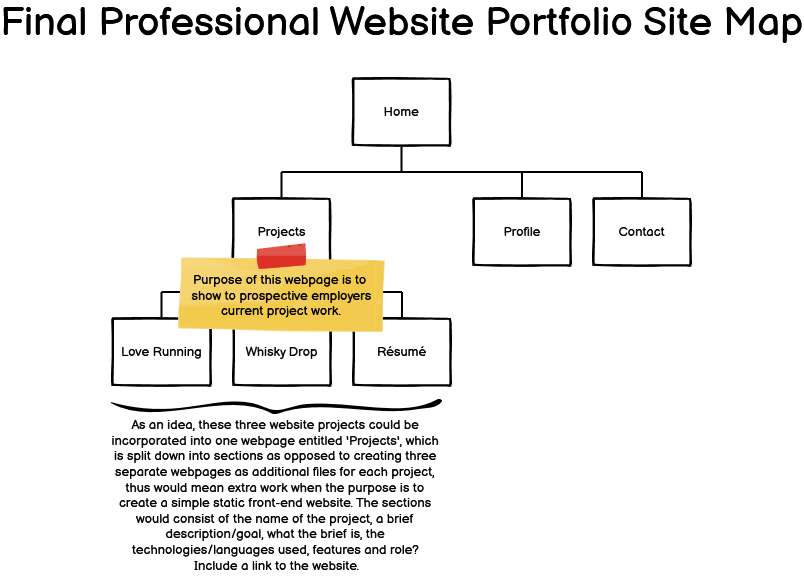
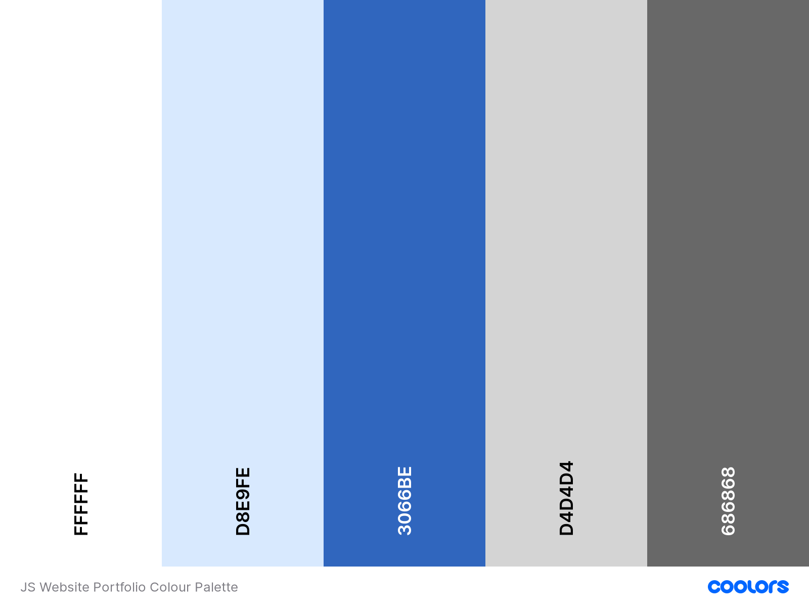

   
   

# Professional Website Portfolio of Jonathan Swift
*Constructed as part of Code Institute's Milestone 1 Project: User-Centric Front-End Development module*

## Demonstration

### **Responsive image of site**

**[Active link to the website portfolio](https://swiftcoder2020.github.io/ms1_portfolio_project/)**

## Table of Contents

1. [Overview](#overview)
2. [User Experience Design (UXD)](#user-experience-design-uxd)
   1. [Project Goals](#project-goals)
   2. [Strategy](#strategy)
   3. [Scope](#scope)
      - [User Stories](#user-stories)
   4. [Structure](#structure)
      - [Interaction Design (IXD)](#interaction-design-ixd)
      - [Information Architecture](#information-architecture)
   5. [Skeleton](#skeleton)
      - [Wireframing the website](#wireframing-the-website)
   6. [Surface](#surface)
      - [Colour palette](#colour-palette)
3. [Features](#features)
4. [Technologies Utilised](#technologies-utilised)
5. [Project bugs and solutions](#project-bugs-and-solutions)
6. [Testing](#testing)
7. [Deployment](#deployment)
8. [Credits](#credits)

# Overview

As the first project into the Diploma, this represents the opportunity to demonstrate my technical 
knowledge and skills learnt within the Full Stack Website Development course, yet blending in some 
educational background in both aspects of project management and website development to construct a 
static front-end site with the use of HTML & CSS. Consideration is taken in encompassing all aspects of 
User Experience Design (UXD) that forms the core part of this development, incorporating the 5 planes 
methodology, ensuring the responsiveness of the website and utilising the languages, tools & technologies 
learnt within the module aforementioned.

# User Experience Design

## Project Goals

The purpose into one of the four milestone projects is based on a firm decision, having considered some 
project ideas, to implement Code Institute's example of developing a professional website portfolio to 
initiate the transition into becoming a Full Stack Website Developer as I progress through the course. 
The focal motivation serves as a specific long yet well founded personal need and aligns towards my 
primary goal of accomplishing the desire into a career change through upskilling, to cater for the target 
audience in presenting information that is useful & relevant to the users which derives from the 
traditional form of a Curriculum Vitae, demonstrating functionality & accessibility to the users given 
that it is ingrained in law and in conclusion, reach out to potential prospective employers & recruiters 
to lead them in initiating contact.

## Strategy

As established above, the product is built consciously with the employers and recruiters in mind, 
specifically their business recruitment objectives to provide them the value in the ability to assess 
what I can offer overall as a candidate, professionally and personally through developing a website 
portfolio. The objective of this strategy is to market myself as a product and provide value through the 
lifecycle in the bulk construction of the project from conception to the development and testing stages 
prior to finally consider the deployment, whereby this operates as a responsive website using the 
approach of the mobile-first principle, that it's a fully functional source of information through the 
user's browser which conforms to conventions and elicits good user experience.

With this in mind, the primary focus is to project into the construction of a subtle and appealing design 
with an element of boldness into the professional portfolio that has potential to evolve. It would also 
encompass the learning principles and methodologies from the course, whilst utilising various resources 
to ensure it is user-friendly and well-structured, demonstrate the capabilities as a developer and provide 
context of their educational & employment background. The aim of this is to convey to prospective 
employers in assisting them to achieve their goal in the duration of their browsing experience to provide 
that value.

In the duration of the conception stage to plan out for this project, research was undertaken to establish 
ideas to consider from other portfolio websites to potentially include appropriate features, design and 
styling themes, especially making colours and images accessible on the basis of the current languages, 
tools and technologies yet within the level of capability. Through my volunteering knowledge and brief 
professional experience, I was able to factor in the user's viewpoint into some design and styling themes, 
structuring websites whilst placing an emphasis into accessibility so was aware of some conventions and 
principles yet further research was required to expand the knowledge into the advancement of website 
development a decade on. Through my professional experience, I identified that the target audience is 
going to be diverse, thus the requirement of the website portfolio is to cater for this wide net of 
opportunities.

## Scope

### User Stories

1. Employers and Recruiters

Both of these types of users operate as separate entities with their own processes relating to recruitment 
in that there are different approaches when it comes to browsing through the website portfolio, therefore 
the user experience needs to cater for this such as briefly assessing one's competency levels through the 
content and development of the coding into the website and also connecting via various professional 
relevant social media/collaborative means i.e. GitHub, LinkedIn, Facebook and Twitter etc. Therefore from 
their perspective whether they are a new or returning visitor to the website, these key points have been 
identified as follows:

a) *Employer's Perspective*

* As a user of a prospective employer, it would be an incentive to experience the ability in browsing 
through a candidate's website portfolio to assimilate into the developer by grasping key relevant 
information via the content as derived from a Curriculum Vitae, which can be obtainable in its 
traditional form through the website. The objective of it is to invite new and/or returning visitors to 
initiate their first contact with the developer which is dependent on the CV being easily shareable to 
potential employers and interview panel to assist them with the decision-making in recruiting that 
individual.

* As an employer who is seeking for a candidate to connect with as a human being, within various roles of 
a Full Stack, Front-end or Back-end Website Developer, it would be of great value to have the ability to 
explore the website portfolio which is rendered correctly, especially with the mobile-first approach 
through the design methodology and principles. The outcome for the user would be to consciously 
comprehend and assess the developer's technical competencies/logical thinking in the development 
lifecycle or experiences through their own project works by way of GitHub or alternatively via a URL of 
their hosting ISP, which an active link is offered to demonstrate this.

* As a user in wanting to employ a candidate, the value is greatly appreciated in identifying the 
confidence in the capability of skillfully coding the website, whilst expressing creativity that reflects 
the aesthetically appealing product that the individual has built and places an emphasis on 
accessibility.

b) *Recruiter's Perspective*

* As a user of a recruiter, there is a continuous responsibility to efficiently identify from an 
accumulation of potential developers, to suggest to their portfolio of clients who will have various 
specific criteria that are determined from a range of companies/businesses whether small, medium or 
large. Therefore in effect, the responsive performance into the functionality of the website portfolio 
enables the great value in accessing useful information, is essential for a recommendation to a client to 
take effect.

* As a recruiter, it is difficult to grasp the in-depth knowledge of the employer that determines whether 
the targeted candidates that is deemed suitable is a good match to the representative client's 
requirements therefore by obtaining a Curriculum Vitae which is widely recognised, it concisely outlines 
the skills of various candidates and assesses their employment & educational history.

* As a user, we receive requests to fill positions on a temporary/contractual basis or identify talents 
from large firms therefore candidates will need to demonstrate with proof of their capability to ensure 
that the role is accomplished or sustained respectively.

c) *Combined User's Perspectives*

* As a combination of users, there is the viewpoint that by browsing, the website portfolio provides the 
content which is expected to be rendered fluently, swiftly and responsively via accessing active 
navigational links and is achieved through means of a peripheral or alternatively through various 
assistive technologies.

* As a user, a contributory factor in interviewing and recruiting the candidate is based upon assessing 
the background history into their education and employment, especially when the developer updates their 
website or GitHub with new examples of recent project work.

* As a user, the ability to instantly establish the purpose of the website efficiently with ease through 
content which can determine effectively whether the candidate is worth pursuing.

* As a user, there is a range of means in contacting the candidate through a form via the website, or 
alternative methods such as social media, email or telephone/mobile number provided via their Curriculum 
Vitae.

2. Website Developer

As a trainee Full Stack Website Developer, I am solely aiming to fully contribute towards the project 
goals and strategy, endeavouring to secure the opportunity of employment within the industry of website 
development to increase my prospects of a fulfilling career, which I am passionate about. It is through my 
technical knowledge, skills and capability that I have an interest in comprehending the full aspects of 
how a website is developed through current languages, tools & technologies to make a difference in 
people's personal & professional lives through my coding ability.

## Structure

The purpose of the Structure plane is to provide the aforementioned new or returning users within the 
Scope an enhanced view aesthetically of a Curriculum Vitae which can be sectioned out accordingly to 
various separate webpages in order to break up the content and utilise some of the website development 
experience as opposed to combining them all into one page. Also gut instinct tells me that with 
reference to the Structure illustration chart, I have identified that this website will be simple and 
linear with a view for it to be in the middle of the ball-park per se as I develop the website deeply in 
due course to create a great standard website portfolio.

### *Interaction Design (IXD)*

In terms of the interaction design, I am conscious of the perspective in the importance of not overusing 
the behaviour of interactive elements, as this would overwhelm users when visiting the website portfolio, 
therefore the approach to this is that by implementing those that are of a subtle yet appropriate use of 
interaction, that would elicit a response that is positive and demonstrates good user experience. Also 
experience tells me that consistency in the design is crucial so this was at the forefront of the mind 
when approaching this project in that the layout elements e.g. header & footer, the theme colours and 
typography are exactly where they should be and styled respectively so that it is pleasing to the eye 
visually for every webpage a user visits. With these in mind, the following points defines what is to be 
included in the interaction design of the website portfolio:

* When users hover over or focus on each of the navigational links, interactive elements such as the 
colour of both the text and underline will change and in addition, the underline will expand horizontally 
for a nice subtle touch recognising where the mouse cursor has been directed to.

* In the Current Skills section when users first views this, as the webpage loads each of the three blocks 
will expand in size from half to full to grasp their attention of the capability into the languages, tools 
& technologies on offer.

* Other interactive elements such as buttons and forms function as part of the user's expectations in that 
it visually indicates which input field they're typing into or that the buttons are active and will 
execute a state of change that would create a positive response as part of the user experience in the 
website portfolio.

* Finally in the footer, interactive elements whereby once hovered over or focused on, the download icon 
will smoothly expand in size and Social icons such as GitHub & LinkedIn will expand in size and change in 
colour to encourage users to click on these links.

### *Information Architecture*

One advantage to this milestone project has enabled the benefit of having already established the site 
structure which is required as standard when undertaking the planning preparations to construct a website, 
and to this day as of September 2020, this is no different given that it relates to the organisational and 
navigational schemas within the course.

Originally, the site structure consisted of 7 webpages in total, however on reflection I soon realised 
that upon reviewing this that this needed to be amended for the purpose of the project and also from a 
content perspective that this should be reduced to 4 webpages thereby retaining the simplicity.

I had also identified as part of the information architecture that the website portfolio will be 
structured in the form of a simple yet basic hierarchy of webpages whereby 'Home' represents the top level 
and 'Projects', 'Profile' and 'Contact' will be of equal horizontal level at the bottom in a tree like 
structure and this is reflected in the site structure, therefore the below links in the next section 
represents the thought process into structuring the webpages through the software Balsamiq.

#### *Wireframing the website*

Below represents how a website will be structured as an information architecture in the form of a sitemap 
along with details for each of the webpages within the project and illustrates the logical movement into 
different sections:

****

- **Home** :- I plan to include a hero image with a brief introductory paragraph and a narrative 
perspective comprising of knowledge & experience in website development.
- **Projects** :- This will consist of mini-projects and examples that have been developed with active 
links to the live websites within the course to retain its simplicity.
- **Profile** :- Containing a hero image of my favourite hobby, a paragraph of professional background & 
experience and also current technological skills.
- **Contact** :- Quite simply this will have a hero image with a brief message and a contact form to 
initiate a call to action.

## Skeleton

As part of the planning preparation into providing the skeleton of the project, which in layman terms is 
essentially a blueprint draft into the design, I had decided to utilise Code Institute's suggestion of 
the software Balsamiq to develop the wireframes into the website portfolio, which will include low & high 
fidelity mock-ups that will form the basis of how it will be constructed. The principle of mobile-first 
strategy is applied whereby the usage and traffic of smartphones exceeds the traditional laptop/desktop 
PC and each of these webpages will be scaled up considering various breakpoints apiece such as mobile, 
tablet, laptop and desktop PC to ensure that great user experience is in responsiveness of the website as 
well as the general design conventions within website development. With this in mind, the following 
developed wireframes at various breakpoints of xs, sm, md, lg & xl are:

- **[Templated theme design](wireframes/templated-design-for-all-devices.pdf)**

- **[Homepage](wireframes/homepage-for-all-devices.pdf)**

- **[Projects](wireframes/projects-for-all-devices.pdf)**

- **[Profile](wireframes/profile-for-all-devices.pdf)**

- **[Contact](wireframes/contact-for-all-devices.pdf)**

Given that this plane is concerned with the navigational and interface design, consideration is taken to 
influence new/returning visitors by prolonging the experience as much as possible, through providing 
content that is specifically relevant and appropriate at various points throughout the experience. This 
results in giving users greater value into the website with the addition of conventions that focuses on 
the visual design of the navigation amongst others.

One of those conventions is that it will include a navigation bar to be positioned at the top in a fixed 
manner that is applicable at all breakpoints to accommodate for each device used which is then based on 
different screen resolutions in pixels. This would consist of a logo which is placed at the top left of 
the webpage in typical fashion and finally the styling of each navigational links that will be visible at 
most breakpoints with the exception of the smaller mobile view, whereby this will feature a hamburger 
menu to create the benefit of a responsive design as space is restricted due to screen resolutions.

Another convention is that the landing homepage is to lead new/returning visitors into the purpose of the 
website as they explore to other webpages with an explanation into the type of portfolio that is being 
conveyed and the differing expectations of both sides i.e. employers/recruiters vs the developer thus the 
outcome is to encourage these users in the direction of a call to action whereby it initiates that contact.

An aspect of website development which is one that I would consider as an essential convention is the 
visual hierarchy whereby the structure of the content is considered i.e. the most or least important, that 
is to be read and this is reflected in the navigation leading the users to various specific webpages.

Finally I have made use of both buttons and icons in sparse measures as I have identified that the usage 
of these are going to be low at a minimal as I felt it wouldn't appropriately relate to this specific 
project.

It is with acknowledgement that a balance has to be struck between the features and usefulness which also 
relates to the Skeleton plane to maximise the usability of the website therefore with this in mind, 
consideration has been given to ensure that the shape remains consistent throughout the webpages to avoid 
a sense of disorientation.

## Surface

Upon the approach into the final fifth plane, I had already identified one benefit prior to the milestone 
1 project in that the colour palette had already been envisaged and it was going to consist of it forming 
the basis into the feel of the design which reflected my personality whereby I had recognised that I 
wanted subtle yet contemporary colours of light blue, vibrant blue, dark grey and white.

Specifically the placement or utilisation of the colours are going to be as follows:

* #FFFFFF - White would be attributed to the separator of each navigational links, underlines each of the 
navigational links to make it more appealing and in addition is there for a reason as it will form the 
effect of the interactive feature. Also it attributes towards the background colour of the content and the 
headings, paragraph and subsequent to hovering over the icons within the footer section.
* #D8E9FE - Beau Blue which is going to be used in the header within the logo & navigational links 
section, the background colour of some contents such as the skills & projects features and the colour of 
the icons prior to it being hovered over.
* #3066BE - True Blue will be used as the font colour prior to hovering over the navigational links, the 
underlined colour which expands once the mouse cursor has hovered over the navigational link, the main 
headings within the contents, the buttons included in the carousel & contact form and also as the focal 
point of the footer as a background colour.
* D4D4D4 - Light Grey appears as the colour for the shadowed effect within the content to add extra 
appeal to key elements.
* #686868 - Dim Grey is to be applicable to the navigational links subsequent to hovering over, the 
subtitle within the content section.

These are illustrated in the colour palette as per below:

### Colour Palette

Source: [Coolors](https://coolors.co/ffffff-d8e9fe-3066be-d4d4d4-686868)

# Features

## Navigation

The navigation bar will be designed by utilising Bootstrap's navbar in a horizontal position as a 
fixed-top effect that will enable users to scroll down the webpage effortlessly ensuring that the logo 
and navigational links remain visible no matter how far down the content goes to contribute to the website 
portfolio being user friendly. These will be consistent across all webpages and are all active in 
functionality as convention dictates to ensure good UX is applied. I was satisfied with the design of the 
hamburger icon as this fitted nicely into the theme of the website. From tablet view and beyond, the only 
change I had applied was to increase the font size as I was aware that it would suit the design better if 
the font size on mobile view was smaller.

Also to add extra appeal usability to the navigation, I designed the links whereby a dark grey is applied 
indicating the current page that the new/returning visitors are browsing through and a more vibrant blue 
to indicate the available links to visit. I have also added a CSS trick whereby once you hover over the 
navigational links, the font colour changes to a dark grey colour and also the underline colour changes 
from white to a vibrant blue which this also expands in size horizontally into a neat feature.

## Skills

Within the Skills section, I have utilised Bootstrap's grid to create 3 x sub-sections to separate 
each type of skill i.e. front-end, back-end and any miscellaneous yet relevant skills relating to website 
development. Again I have also implemented a neat feature within each of the rectangular shapes whereby 
once the landing page has loaded, these 3 sub-sections are smaller in size to begin with yet scales up as 
a CSS animation trick, in size as the seconds pass to direct the employer's & recruiter's attention.

## Projects

This section will feature Bootstrap's Carousel to highlight the developer's best or recent project works 
in which an image is provided showing the website's responsiveness and will include a button to direct 
users to the URL of the project. It will also contain a section utilising Bootstrap's Card feature so as 
to exhibit the demonstration of all the previous developments as a portfolio whereby each project includes 
a synopsis such as an overview into the website, what languages, tools and technologies were used so that 
the new/returning visitors can grasp with recognition the purpose and capabilities, prior to visiting the 
external links provided.

## Contact

Lastly this webpage will feature a customised format of Bootstrap's form with the aim of including a modal 
to imply a part functionality and confirmation that the submission button works rather than leaving it in 
an inactive state to elicit good user experience.

# Technologies Utilised

* GitHub :- collaborative tool in a community of developers
* GitPod :- editor utilised to code the website
* Git :- a form of versioning control
* Bootstrap v4.5.2 :- this is a CSS framework which is used to assist with making the design
* Google Fonts
* Font Awesome
* jQuery :- a brief bit of HTML coding has been applied which relates to the functionality of the 
hamburger menu component applicable in mobile view.
* Popper :- a brief bit of HTML coding has been applied which relates to the functionality of the 
hamburger menu component applicable in mobile view.
* JavaScript :- a brief bit of HTML coding has been applied which relates to the functionality of the 
hamburger menu component applicable in mobile view.
* CSS3 :- this is the current standard that is used.
* HTML5 :- this is the current standard that is used.
* Balsamiq :- the software has been utilised to create wireframes as part of the preparational work into 
the website portfolio in mock up form.

# Project Bugs and Solutions

Obviously a website project is not without its technical bugs, (and no I'm not talking of the C19 kind, 
even though a virus exists within the technical world!) which requires the skill of implementing a 
problem-solving approach to reach to good fixable solutions. These consisted of:

1. The content wasn't rendered correctly between the navigational links and the hero images as it was 
being hidden under navbar due to Bootstrap's CSS styling of fixed-top. This presented me with a problem 
as I hadn't utilised the placement of navbars before let alone used the framework so I wasn't aware that 
it may be a known issue, therefore as a result of researching, I found a fix to resolve this through 
[Stack Overflow](https://stackoverflow.com/questions/11124777/twitter-bootstrap-navbar-fixed-top-overlapping-site)
which required setting the body class with the attribute of padding-top and setting a pixel unit at a 
couple of breakpoints using media query as I scaled up the navbar for laptop view onwards.

2. The logo image was overflowing the hamburger menu icon, meaning that it forced this to go below the 
logo as opposed to next to it as I had wireframed the design. After consulting with the Slack community, 
it was because the logo was set at 320px and needed to be set at 200px maximum.

# Testing

1. Utilised the website [Online-Spellcheck](https://www.online-spellcheck.com/) to ensure that spelling and grammar of the readme.md is correct.

2. Tested that the hyperlinked logo on each internal webpage leads users to the homepage.

3. Tested each navigational link items such as Home, Projects, Profile and Contact in a logical order & 
thoroughly on every webpage to ensure it is functioning correctly i.e. that it is not broken; and 
directing to the right webpage. Also when visiting a particular webpage, that the contrast colour within 
the navigational link signifies the existing webpage that the user is browsing through for good UX.

4. Tested the hamburger menu icon to ensure that the toggler functions and that each navigational link is 
positioned exactly like the wireframe design.

5. Tested the responsiveness of the website portfolio to ensure it reflects the design of the wireframe by 
utilising Google Chrome's Dev Tools to establish if the structure is rendered correctly from devices at 
mobile view in 320px scaling up to desktop PC view at a maximum of 1920px.

6. Tested by refreshing the homepage at the Skills section to be assured that when the webpage loads, each 
of the sub-sections expands from a smaller size into a set height & width using CSS animation.

7. Tested the Download CV icon to ensure that it expands when you hover over the icon to signify 
interaction and that when you click on it, a new secure tab is opened producing my Curriculum Vitae in an 
integrated Adobe Reader pdf file.

8. Tested icons related to Social Media whereby similar to hovering on the Download CV icon, it expands 
to give a sense of engagement to lure the new/returning visitor into viewing my GitHub profile & projects 
and also my LinkedIn account if they wish to connect with me via a new and secure way of opening a new 
tab.

9. Tested both the left and right arrow icons within the carousel in that it functions correctly to the 
next image slide.

10. Tested the button within the carousel to ensure that it leads the users to a new secure tab and that 
the correct website loads up which is related to the specific project worked on. As I clicked on the 
button I had realised that this didn't function as it was supposed to, therefore a quick fix was to apply 
some simply HTML code so that it can open up in a new tab as described by adding target="_blank" and 
rel="noopener".

11. Tested the indicators to ensure that the links directs users to a specific image within the carousel.

12. Tested by refreshing the Projects webpage at the section of the portfolio work to ensure that when the 
webpage loads, each of the sub-sections of specific projects undertaken expands from a smaller size into a 
set height & width using CSS animation.

13. Tested both the GitHub & external link icons to guide new/returning visitors to specific projects 
developed within the repository and also a live link to demonstrate the finished result of the website.

14. Tested all fields whereby once clicked into the input area, it highlights the specific data entry 
field to engage the user's attention what section is currently being filled in.

15. Tested the Submit button within the Contact webpage whereby all fields remained blank with no inputs 
to result in an error message conveying 'Please fill out this field' to validate all fields have been 
inputted prior to submission.

16. Tested by utilising the [HTML Validator](https://validator.w3.org/) for each webpage of the website 
to ensure the coding quality is of a high standard.

- Homepage:- this flagged up 3 warnings regarding a misuse of aria-label.

- Projects:- this flagged up 6 warnings regarding a misuse of aria-label.

- Profile:- this flagged up 3 warnings regarding a misuse of aria-label.

- Contact:- this flagged up 2 errors, the first was regarding an attribute not allowed on the input 
element, however this was rectified by removing aria-desscribedby="". The second was concerning the label 
and input whereby the value of the 'for' attribute of the 'label' element must be the ID of a non-hidden 
form control. This was rectified by ensuring that the for and id have matching names which is something 
that was suggested on [Stack Overflow](https://stackoverflow.com/questions/38569235/the-for-attribute-of-the-label-element-must-refer-to-a-non-hidden-form-control/44844597). 
Otherwise, this flagged up 3 warnings regarding a misuse of aria label.

17. Tested by utilising the [CSS Validator](https://jigsaw.w3.org/css-validator/)

18. Tested the colour palette to ensure of its accessibility via [Accessible Colors](https://www.accessible-colors.com) 
and realised that I hadn't considered the emphasis of checking this prior to the development of the 
website. This was rectified by amending the colour scheme slightly as the contrast ratio was a bit low 
which meant I had considered this yet adjusted it to ensure compliance. Also double checked on 
[a11y](https://color.a11y.com/) after Accessible Colors which it passed with flying colours.

19. Tested by utilising [Google's Mobile-Friendly Test](https://search.google.com/test/mobile-friendly) 
into the responsiveness of the website to ensure that as mobile phones are prominent in our daily lives 
each webpage is rendered correctly to fit within these devices. The following webages have been tested:-

- [Homepage](https://search.google.com/test/mobile-friendly?id=h2UaGWAm35-C1obj2TCJhA)

- [Projects](https://search.google.com/test/mobile-friendly?id=u9JssgcSh9xVHkm98k0WGw)

- [Profile](https://search.google.com/test/mobile-friendly?id=yjE3a13AyV9FRkj7c7pl4A)

- [Contact](https://search.google.com/test/mobile-friendly?id=-UFIP_KVTRLG4OFN4cqJTA)

 

<!--   as the contrast ration was a bit low after running through  -->

<!-- experienced a margin/padding issue to Bootstrap's grid whereby each skill block wasn't being separated -->

<!-- code validators from w3c, manually checking on different browsers, document the process -->

# Deployment

This project has been deployed on GitHub Pages with the following process:

* All code was written on Gitpod, an online IDE.
* The code was then pushed to GitHub where it is stored in my Repository.
* Under the settings section of the GitHub repository, scrolled down to GitHub Pages section.
* Under 'Source' drop-down, the 'Master branch' was selected.
* Once selected, this publishes the project to GitHub Pages and displays the site url.
* There is no difference between the deployed version and the development version.
* The code can be run locally through clone or download.
* You can do this by opening the repository, clicking on the green 'Code' button and selecting either 'clone or download'.
* The Clone option provides a url, which you can use on your desktop IDE.
* The Download ZIP option provides a link to download a ZIP file which can be unzipped on your local machine.

<!-- https://stackoverflow.com/questions/6771258/what-does-meta-http-equiv-x-ua-compatible-content-ie-edge-do -->

# Credits

## Code

<!-- should already have done this in the development of the project -->

## Content

All text contents is written by myself.

## Media

Main images taken from [Pexels](https://www.pexels.com/) a free source stock image website 
Main icons taken from [Icon Finder](https://www.iconfinder.com/) a free source icon website

## Acknowledgements

* The Slack Community at Code Institute for their great support

* User Centric front-end development lead [Jim Morel](https://github.com/JimLynx) for his sterling work in providing a webinar to assist with Milestone 1 Project preparations, [Aukje van der Wal](https://github.com/byIlsa) for her support in commencing the project when I had a confidence doubting moment of not knowing what to do.