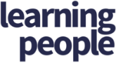

   
   

# Professional Website Portfolio of Jonathan Swift
*Constructed as part of Code Institute's Milestone 1 Project: User-Centric Front-End Development module*

## Demonstration

**[Active link to the website portfolio](https://swiftcoder2020.github.io/ms1_portfolio_project/)**

## Table of Contents

1. [Overview of the Milestone 1 Project](https://github.com/swiftcoder2020/ms1_portfolio_project/blob/master/README.md#overview-of-the-milestone-1-project)
2. [User Experience Design (UXD)](https://github.com/swiftcoder2020/ms1_portfolio_project/blob/master/README.md#user-experience-design-uxd)
   1. [Project Goals](https://github.com/swiftcoder2020/ms1_portfolio_project/blob/master/README.md#project-goals)
   2. [Strategy](https://github.com/swiftcoder2020/ms1_portfolio_project/blob/master/README.md#strategy)
   3. [Scope](https://github.com/swiftcoder2020/ms1_portfolio_project/blob/master/README.md#scope)
      - [User Stories](https://github.com/swiftcoder2020/ms1_portfolio_project/blob/master/README.md#user-stories)
   4. [Structure](https://github.com/swiftcoder2020/ms1_portfolio_project/blob/master/README.md#structure)
      - [Interaction Design (IXD)](https://github.com/swiftcoder2020/ms1_portfolio_project/blob/master/README.md#interaction-design-ixd)
      - [Information Architecture](https://github.com/swiftcoder2020/ms1_portfolio_project/blob/master/README.md#information-architecture)
   5. [Skeleton](https://github.com/swiftcoder2020/ms1_portfolio_project/blob/master/README.md#skeleton)
      - [Wireframing the website]()
   6. [Surface](https://github.com/swiftcoder2020/ms1_portfolio_project/blob/master/README.md#surface)
3. [Features](https://github.com/swiftcoder2020/ms1_portfolio_project/blob/master/README.md#features)
4. [Languages, Tools & Technologies Utilised](https://github.com/swiftcoder2020/ms1_portfolio_project/blob/master/README.md#languages-tools--technologies-utilised)
5. [Testing](https://github.com/swiftcoder2020/ms1_portfolio_project/blob/master/README.md#testing)
6. [Deployment](https://github.com/swiftcoder2020/ms1_portfolio_project/blob/master/README.md#deployment)
7. [Credits](https://github.com/swiftcoder2020/ms1_portfolio_project/blob/master/README.md#credits)

# Overview of the Milestone 1 Project

As the first project into the Diploma, this represents the opportunity to demonstrate my technical 
knowledge and skills learnt within the Full Stack Website Development course, yet blending in some 
educational background in both aspects of project management and website development to construct a 
static front-end site. Consideration is taken in encompassing all aspects of User Experience Design (UXD) 
that forms the core part of this development, incorporating the 5 planes methodology, ensuring the 
responsiveness of the website and utilising the languages, tools & technologies learnt within the module 
aforementioned.

# User Experience Design (UXD)

## Project Goals

The purpose into one of the four milestone projects is based on a firm decision, having considered some 
project ideas, to implement Code Institute's example of developing a professional website portfolio to 
initiate the transition into becoming a Full Stack Website Developer as I progress through the course. 
The focal motivation serves as a specific long yet well founded personal need and aligns towards my 
primary goal of accomplishing the desire into a career change through upskilling, to cater for the target 
audience in presenting information that is useful & relevant to the users which derives from the 
traditional form of a Curriculum Vitae, demonstrating functionality & accessibility to the users given 
that it is ingrained in law and in conclusion, reach out to potential prospective employers & recruiters 
to lead them in initiating contact.

## Strategy

As established above, the product is built consciously with the employers and recruiters in mind, 
specifically their business recruitment objectives to provide them the value in the ability to assess 
what I can offer overall as a candidate, professionally and personally through developing a website 
portfolio. The objective of this strategy is to market myself as a product and provide value through the 
lifecycle in the bulk construction of the project from conception to the development and testing stages 
prior to finally consider the deployment, whereby this operates as a responsive website using the 
approach of the mobile-first principle, that it's a fully functional source of information through the 
user's browser which conforms to conventions and elicits good user experience.

With this in mind, the primary focus is to project into the construction of a subtle and appealing design 
with an element of boldness into the professional portfolio that has potential to evolve. It would also 
encompass the learning principles and methodologies from the course, whilst utilising various resources 
to ensure it is user-friendly and well-structured, demonstrate the capabilities as a developer and provide 
context of their educational & employment background. The aim of this is to convey to prospective 
employers in assisting them to achieve their goal in the duration of their browsing experience to provide 
that value.

In the duration of the conception stage to plan out for this project, research was undertaken to establish 
ideas to consider from other portfolio websites to potentially include appropriate features, design and 
styling themes, especially making colours and images accessible on the basis of the current languages, 
tools and technologies yet within the level of capability. Through my volunteering knowledge and brief 
professional experience, I was able to factor in the user's viewpoint into some design and styling themes, 
structuring websites whilst placing an emphasis into accessibility so was aware of some conventions and 
principles yet further research was required to expand the knowledge into the advancement of website 
development a decade on. Through my professional experience, I identified that the target audience is 
going to be diverse, thus the website portfolio requires to cater for this wide net of opportunities.

## Scope

### User Stories

1. Employers and Recruiters

Both of these types of users operate as separate entities with their own processes relating to recruitment 
in that there are different approaches when it comes to browsing through the website portfolio, therefore 
the user experience needs to cater for this such as briefly assessing one's competency levels through the 
content and development of the coding into the website and also connecting via various professional 
relevant social media/collaborative means i.e. GitHub, LinkedIn, Facebook and Twitter etc. Therefore from 
their perspective whether they are a new or returning visitor to the website, these key points have been 
identified as follows:

#### *Employer's Perspective*

* As a user of a prospective employer, it would be an incentive to experience the ability in browsing 
through a candidate's website portfolio to assimilate into the developer by grasping key relevant 
information via the content as derived from a Curriculum Vitae, which can be obtainable in its 
traditional form through the website. The objective of it is to invite new and/or returning visitors to 
initiate their first contact with the developer which is dependent on the CV being easily shareable to 
potential employers and interview panel to assist them with the decision-making in recruiting that 
individual.

* As an employer who is seeking for a candidate to connect with as a human being, within various roles of 
a Full Stack, Front-end or Back-end Website Developer, it would be of great value to have the ability to 
explore the website portfolio which is rendered correctly, especially with the mobile-first approach 
through the design methodology and principles. The outcome for the user would be to consciously 
comprehend and assess the developer's technical competencies/logical thinking in the development 
lifecycle or experiences through their own project works by way of GitHub or alternatively via a URL of 
their hosting ISP, which an active link is offered to demonstrate this.

* As a user in wanting to employ a candidate, the value is greatly appreciated in identifying the 
confidence in the capability of skillfully coding the website, whilst expressing creativity that reflects 
the aesthethically appealing product that the individual has built and places an emphasis on 
accessibility.
  
#### *Recruiter's Perspective*

* As a user of a recruiter, there is a continuous responsibility to efficiently identify from an 
accumulation of potential developers, to suggest to their portfolio of clients who will have various 
specific criterias that are determined from a range of companies/businesses whether small, medium or 
large. Therefore in effect, the responsive performance into the functionality of the website portfolio 
enables the great value in accessing useful information, is essential for a recommendation to a client to 
take effect.

* As a recruiter, it is difficult to grasp the in-depth knowledge of the employer that determines whether 
the targeted candidates that is deemed suitable is a good match to the representative client's 
requirements therefore by obtaining a Curriculum Vitae which is widely recognised, it concisely outlines 
the skills of various candidates and assesses their employment & educational history.

* As a user, we receive requests to fill positions on a temporary/contractual basis or identify talents 
from large firms therefore candidates will need to demonstrate with proof of their capability to ensure 
that the role is accomplished or sustained respectively.

#### *Combined User's Perspectives*

* As a combination of users, there is the viewpoint that by browsing, the website portfolio provides the 
content which is expected to be rendered fluently, swiftly and responsively via accessing active 
navigational links and is achieved through means of a peripheral or alternatively through various 
assistive technologies.

* As a user, a contributory factor in interviewing and recruiting the candidate is based upon assessing 
the background history into their education and employment, especially when the developer updates their 
website or GitHub with new examples of recent project work.

* As a user, the ability to instantly establish the purpose of the website efficiently with ease through 
content which can determine effectively whether the candidate is worth pursuing.

* As a user, there is a range of means in contacting the candidate through a form via the website, or 
alternative methods such as social media, email or telephone/mobile number provided via their Curriculum 
Vitae.

2. Website Developer 

As a trainee Full Stack Website Developer, I am solely aiming to fully contribute towards the project 
goals and strategy, endeavouring to secure the opportunity of employment within the industry of website 
development to increase my prospects of a fulfilling career, which I am passionate about. It is through my 
technical knowledge, skills and capability that I have an interest in comprehending the full aspects of 
how a website is developed through current languages, tools & technologies to make a difference in 
people's personal & professional lives through my coding ability.

## Structure

The purpose of the Structure plane is to provide the aforementioned new or returning users within the 
Scope an enhanced view aesthetically of a Curriculum Vitae which can be sectioned out accordingly to 
various separate webpages in order to break up the content and utilise some of the website development 
experience as opposed to combining them all into one page. Also gut instinct tells me that with 
reference to the Structure illustration chart, I have identified that this website will be simple and 
linear with a view for it to be in the middle of the ball-park per se as I develop the website deeply in 
due course to create a great standard website portfolio.

### *Interaction Design (IXD)*

In terms of the interaction design, I am conscious of the perspective in the importance of not overusing 
the behaviour of interactive elements, as this would overwhelm users when visiting the website portfolio, 
therefore the approach to this is that by implementing those that are of a subtle yet appropriate use of 
interaction, that would elicit a response that is positive and demonstrates good user experience. Also 
experience tells me that consistency in the design is crucial so this was at the forefront of the mind 
when approaching this project in that the layout elements e.g. header & footer, the theme colours and 
typography are exactly where they should be and styled respectively so that it is pleasing to the eye 
visually for every webpage a user visits. With these in mind, the following points defines what is to be 
included in the interaction design of the website portfolio:

* When users hover over or focus on each of the navigational links, interactive elements such as the 
colour of both the text and underline will change and in addition, the underline will expand horizontally 
for a nice subtle touch recognising where the mouse cursor has been directed to.

* In the Current Skills section when users first views this, as the webpage loads each of the three blocks 
will expand in size from half to full to grasp their attention of the capability into the languages, tools 
& technologies on offer.

* Other interactive elements such as buttons and forms function as part of the user's expectations in that 
it visually indicates which input field they're typing into or that the buttons are active and will 
execute a state of change that would create a positive response as part of the user experience in the 
website portfolio.

* Finally in the footer, interactive elements whereby once hovered over or focused on, the download icon 
will smoothly expand in size and Social icons such as GitHub & LinkedIn will expand in size and change in 
colour to encourage users to click on these links.

### *Information Architecture*

One advantage to this milestone project has enabled the benefit of having already established the site 
structure which is required as standard when undertaking the planning preparations to construct a website, 
and to this day as of September 2020, this is no different given that it relates to the organisational and 
navigational schemas within the course.

Originally, the site structure consisted of 7 webpages in total, however on reflection I soon realised 
that upon reviewing this that this needed to be amended for the purpose of the project and also from a 
content perspective that this should be reduced to 4 webpages thereby retaining the simplicity.

I had also identified as part of the information architecture that the website portfolio will be 
structured in the form of a simple yet basic hierarchy of webpages whereby 'Home' represents the top level 
and 'Projects', 'Profile' and 'Contact' will be of equal horizontal level at the bottom in a tree like 
structure and this is reflected in the site structure, therefore the below links represents the thought 
process into structuring the webpages through the software Balsamiq,  

#### *Wireframing the website*

Below represents how a website will be structured as an information architecture in the form of a sitemap 
along with details for each of the webpages within the project:

**[Website Portfolio Site Structure](wireframes/website-portfolio-sitemap.png)**

- **Home** :- I plan to include a hero image with a brief introductory paragraph and a narrative 
perspective comprising of knowledge & experience in website development.
- **Projects** :- This will consist of mini-projects and examples that have been developed with active 
links to the live websites within the course to retain its simplicity.
- **Profile** :- Containing a hero image of my favourite hobby, a paragraph of professional background & 
experience and also current technological skills.
- **Contact** :- Quite simply this will have a hero image with a brief message and a contact form.

## Skeleton

As part of the planning preparation into providing the skeleton of the project, which in layman terms is 
essentially a blueprint draft into the design, I had decided to utilise Code Institute's suggestion of 
the software Balsamiq to develop the wireframes into the website portfolio, which will include low & high 
fidelity mock-ups that will form the basis of how it will be constructed. The principle of mobile-first 
strategy is applied whereby the usage and traffic of smartphones exceeds the traditional laptop/desktop 
PC and each of these webpages will be scaled up considering various breakpoints apiece such as mobile, 
tablet, laptop and desktop PC to ensure that great user experience is in responsiveness of the website as 
well as the general design conventions within website development. With this in mind, the following 
developed wireframes are:

**[Templated theme design](wireframes/templated-design-for-all-devices.pdf)**

- **[Hompage](wireframes/homepage-for-all-devices.pdf)**

- **[Projects](wireframes/projects-for-all-devices.pdf)**

- **[Profile](wireframes/profile-for-all-devices.pdf)**

- **[Contact](wireframes/contact-for-all-devices.pdf)**

Given that this plane is concerned with the navigational and interface design, consideration is taken to 
influence new/returning visitors by prolonging the experience as much as possible, through providing 
content that is specifically relevant and appropriate at various points throughout the experience. This 
results in giving users greater value into the website with the addition of conventions that focuses on 
the visual design of the navigation which will include a fixed-top navbar that will enable users to scroll 
down effortlessly ensuring that the navigational links remain visible no matter how far down the content 
goes, which will be consistent across all webpages and these are all active in functionality as convention 
dictates to contribute to good UX. Also the fixed-top navbar will apply for most breakpoints with the 
exception of the smaller mobile view whereby this is to feature a hamburger menu for the benefit of being 
a responsive design.

The landing homepage is to lead new/returning visitors into the purpose of the website as they explore to 
other webpages with an explanation into the type of portfolio that is being conveyed and the differing 
expectations of both sides i.e. employers/recruiters vs the developer. 

<!-- lead user towards continuing the experience, introduce specific content at the most relevant and
appropriate points in the experience -->

## Surface

<!-- Colour Palette --> contemporary colours

# Features

<!-- Bootstrap Carousel, form which features a modal to confirm submission button works (good user experience) -->

# Languages, Tools & Technologies Utilised

* Bootstrap v4.5.2 :- this is a CSS framework which is used to assist with making the design
* Google Fonts
* Font Awesome
* CSS
* HTML
* Balsamiq

# Testing

<!-- realised that I hadn't considered the element of accessibility, therefore amended the colour scheme slightly as the contrast ration was a bit low after running through https://www.accessible-colors.com -->

<!-- logo image was overflowing, yet after consulting with the slack community it was because the logo was set at 320px and needed to be set at 200px -->

<!-- experienced a margin/padding issue to Bootstrap's grid whereby each skill block wasn't being separated -->

<!-- code validators from w3c, manually checking on different browsers, document the process -->

<!-- had issue with fixed-top on navbar but fixed it with putting body { padding-top: 80px; } at mobile view, then at laptop view increased this in media queries to 130px and also increased the viewheight of hero image to 70vh. Source: https://stackoverflow.com/questions/11124777/twitter-bootstrap-navbar-fixed-top-overlapping-site -->

# Deployment

# Credits

## Code

## Content

## Media

<!-- https://www.pexels.com/ -->
<!-- https://www.iconfinder.com/ -->

## Acknowledgements

* The Slack Community at Code Institute for their great support

* User Centric front-end development lead [Jim Morel](https://github.com/JimLynx) for his sterling work in providing a webinar to assist with Milestone 1 Project preparations, [Aukje van der Wal](https://github.com/byIlsa) for her support in commencing the project when I had a confidence doubting moment of not knowing what to do.